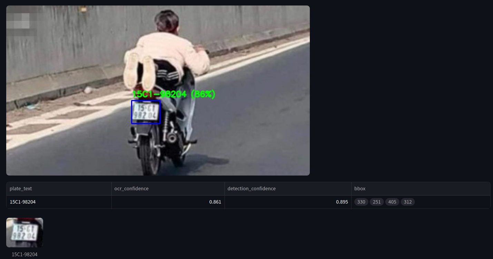
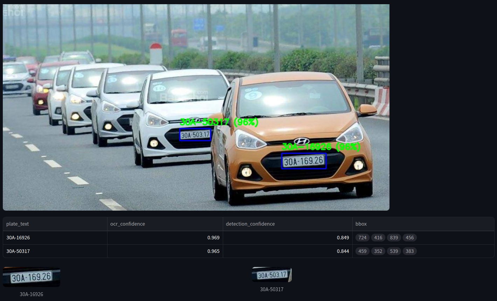
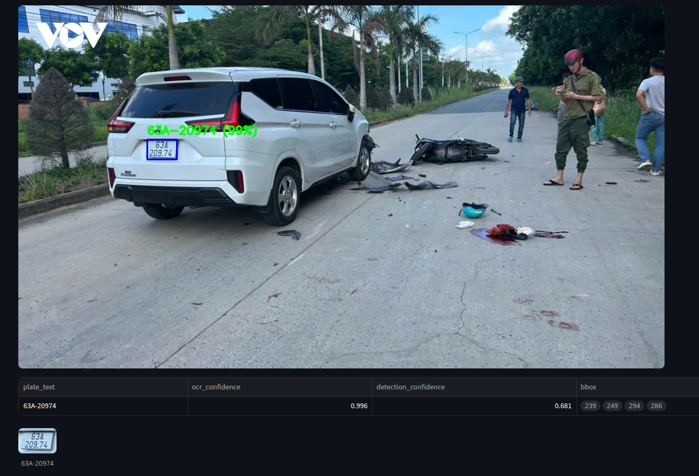

# RLVDS-VN: Vietnam Red Light Violation Detection System

> **Note:** Đây là một learning project, được phát triển nhằm mục đích nghiên cứu và học tập về Computer Vision, OCR và thiết kế pipeline xử lý video.

RLVDS-VN là hệ thống phát hiện xe vượt đèn đỏ tại Việt Nam. Hệ thống đọc video/camera góc cố định, phát hiện biển số bằng YOLOv5, nhận diện ký tự bằng PaddleOCR, kiểm tra biển số có nằm trong vùng vi phạm khi đèn đỏ hay không, rồi lưu bằng chứng vào SQLite.

## Tính năng chính

- Phát hiện biển số bằng YOLOv5 custom weights.
- OCR biển số bằng PaddleOCR, có thể chạy qua OCR microservice CPU để tránh xung đột CUDA/cuDNN.
- Logic vi phạm dựa trên trạng thái đèn đỏ và anchor point của bbox nằm trong polygon giám sát.
- Cảnh báo tốc độ ước lượng trên UI dựa trên chuyển động bbox biển số qua nhiều frame.
- Giao diện Streamlit cho video stream và upload ảnh OCR riêng lẻ.
- Lưu record vi phạm, ảnh scene và ảnh biển số vào SQLite + thư mục evidence.
- Cấu hình bằng YAML, `config/local.yaml` và env vars prefix `RLVDS_`.

## Công nghệ sử dụng

| Thành phần | Công nghệ | Vai trò |
| --- | --- | --- |
| Ngôn ngữ | Python 3.10 | Runtime chính |
| Video/CV | OpenCV, NumPy | Đọc frame, crop, xử lý ảnh và vẽ overlay |
| Detection | YOLOv5 qua `torch.hub.load` | Phát hiện bbox biển số |
| OCR chính | PaddleOCR | Nhận diện text biển số |
| OCR runtime | HTTP microservice CPU | Tách PaddleOCR khỏi process Streamlit/PyTorch khi chạy video |
| OCR fallback | YOLOv5 character OCR | Nhận diện từng ký tự khi cần thay engine |
| Spatial/Temporal | Polygon + TrafficLightFSM | Kiểm tra anchor point trong vùng vi phạm khi đèn đỏ |
| OCR cache | IOU-based `PlateTrackCache` | Giảm số lần gọi OCR trên các frame liên tiếp |
| UI | Streamlit | Video stream dashboard và tab Image OCR |
| CLI | `main.py` | Chạy pipeline từ terminal |
| Database | SQLite | Lưu record vi phạm và đường dẫn evidence |
| Config | Pydantic Settings + YAML + env vars | Cấu hình type-safe, override bằng `RLVDS_` |
| Tracking | IOU matching + SORT-style tracker | Theo dõi bbox biển số cho cache/speed warning; chưa là điều kiện chính của red-light violation |
| Test | pytest | Unit tests cho detection, OCR, cache, polygon, persistence |
| Container | Docker Compose | Chạy demo Streamlit tại `localhost:8501` |

## Cấu trúc dự án

```text
RLVDS-VN-System/
├── app.py                         # Streamlit UI: video stream + image OCR
├── main.py                        # CLI entry point
├── Dockerfile                     # Docker image cho Streamlit app
├── docker-compose.yml             # Runtime demo tại localhost:8501
├── requirements.txt               # Python dependencies
├── config/
│   ├── default.yaml               # Config mặc định
│   └── settings.py                # Pydantic settings, YAML/env merge
├── rlvds/
│   ├── core/                      # Base dataclasses, Pipeline, MiniPipeline, CachedPipeline
│   ├── ingestion/                 # VideoSource, FrameBuffer
│   ├── detection/                 # YOLOv5 license plate detector
│   ├── ocr/                       # PaddleOCR wrapper, OCR server, preprocessing, cache
│   ├── spatial/                   # Polygon utilities, ViolationZone
│   ├── temporal/                  # TrafficLightFSM, ViolationDetector
│   ├── persistence/               # SQLite Database, models, repository
│   ├── tracking/                  # SORT-style tracker, Kalman state, IOU matching
│   └── utils/                     # Logger, visualization, IO helpers
├── tests/                         # Unit tests
├── docs/
│   ├── ARCHITECTURE.md            # Kiến trúc kỹ thuật chi tiết
│   ├── ProjectOverview.md         # Tổng quan project
│   └── test_results/              # Ảnh kết quả test trong README
├── training/                      # Notebook/config training, gồm YOLOv5 vendored upstream
├── weights/                       # Model weights local, không commit
└── data/                          # Sample video, SQLite DB, evidence local
```

## Cài đặt

```bash
git clone <repo-url>
cd RLVDS-VN-System

conda create -n lpr_env python=3.10 -y
conda activate lpr_env

pip install torch torchvision --index-url https://download.pytorch.org/whl/cu124
pip install -r requirements.txt
```

Chuẩn bị file local thường dùng:

- Model detection mặc định: `weights/license_plate.pt`
- Video mẫu mặc định: `data/samples/sample.mp4`
- Override cấu hình local: `config/local.yaml`

## Chạy ứng dụng

Streamlit UI:

```bash
streamlit run app.py
```

CLI:

```bash
python main.py --video data/samples/sample.mp4 --no-display
python main.py --camera 0
```

Docker Compose:

```bash
DOCKER_BUILDKIT=0 docker compose up --build
```

Compose mặc định mở Streamlit tại `http://localhost:8501`, mount `data/samples` và `weights` read-only, đồng thời dùng SQLite trong tmpfs `/tmp/rlvds`.

## Cấu hình

Config mặc định nằm ở `config/default.yaml`. Có thể override bằng `config/local.yaml` hoặc env vars:

```bash
RLVDS_DETECTION__DEVICE=cpu
RLVDS_DETECTION__CONFIDENCE_THRESHOLD=0.6
RLVDS_DATABASE__URL=sqlite:///data/rlvds.db
```

Speed warning v1 chỉ hiển thị cảnh báo trên UI, không lưu record SQLite và không thay đổi logic vi phạm đèn đỏ. Tốc độ km/h phụ thuộc calibration thủ công theo cảnh quay:

```yaml
speed:
  enabled: true
  limit_kmh: 50.0
  meters_per_pixel: 0.05
```

Với camera thật, chỉnh `meters_per_pixel` trong `config/local.yaml` theo khoảng cách thực trên vùng đường đang giám sát. Nếu chưa calibration, chỉ dùng cảnh báo này như tín hiệu tham khảo cho demo.

## Test

```bash
python -m pytest
python -m pytest tests/test_frame_integrity.py
python -m pytest tests/test_ocr_cache.py tests/test_persistence.py
```

## Test Results







## Tài liệu chi tiết

- [ProjectOverview.md](docs/ProjectOverview.md): mục tiêu, phạm vi, luồng sử dụng và các quyết định cấp project.
- [ARCHITECTURE.md](docs/ARCHITECTURE.md): kiến trúc kỹ thuật, module, invariant và luồng dữ liệu trong code.
